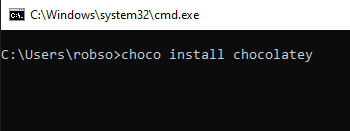
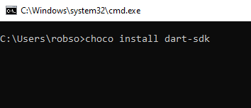
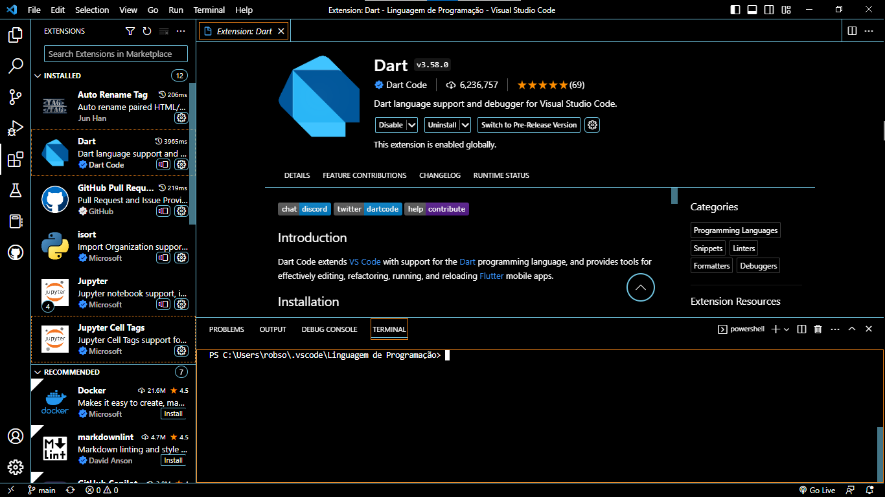
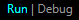

# Instalação do Dart

> # Abra seu cmd com:

## Windows + R
<html>
   <br>
</html>

## Digite cmd e com o atalho Ctrl + Shirt + Enter, já executando o cmd no modo de administrador.

<html>
   
</html>

<html>
   <br>
   <br>
</html>

> # Vamos instalar o choco:
```cmd
   @"%SystemRoot%\System32\WindowsPowerShell\v1.0\powershell.exe" -NoProfile -InputFormat None -ExecutionPolicy Bypass -Command "[System.Net.ServicePointManager]::SecurityProtocol = 3072; iex ((New-Object System.Net.WebClient).DownloadString('https://community.chocolatey.org/install.ps1'))" && SET "PATH=%PATH%;%ALLUSERSPROFILE%\chocolatey\bin"
```

> # Instalado o Choco, vamos instalar o Chocolatey no cmd coloque:

```cmd
   choco install chocolatey 
```

#### | Imagem Ex:

<html>
   
   <br>
</html>

> ``
 " Caso não instale reinicie o computador e tente novamente. " 
 ``

<html>
   <br>
</html>

> # Agora vamos instalar o Dart no cmd coloque:

```cmd
 choco install dart-sdk 
 ```

#### | Image Ex:

<html>
   
   <br>
</html>


> `` " Caso não instale reinicie o computador e tente novamente. " ``

<html>
   <br>
</html>

# Vamos Instalar o Dart no VSCode, no menu extensões digite Dart e instale a extensão:

<html>
   
   <br>
   <br>
</html>

## Crie um arquivo com o nome HelloWord.dart

<html>
   
   <br>
   <br>
</html>

# No Arquivo coloque o seguinte código:
```dart
main(){
   print("Hello Word")
}
```

### Tem duas maneiras de se rodar o codigo 
#### 1ª com o run:
<html>
   
</html>

#### 2ª via terminal:
#### no terminal você precisa colocar "dart NomeDoArquivo.dart", Ex:
<html>
   
</html>

# Explicando o código

---
### A função Main() é o primeiro código a ser lido, ou seja é um um local de entrada do programa
---
### Na função Main() tem dentro o print(), que será responsavel por "imprimir" o frase "Hello Word" que é do tipo string
---
## Caso tenho feito tudo certo aparecerá  frase "Hello Word"

<html>
   <br>
</html>

#### Link do documentação utilizada nesse trabalho: <a taget="_blank" href="https://docs.chocolatey.org/en-us/choco/setup#more-install-options">chocolatey</a>
##### OBS: isso é um trabalho escolar

<html>
   <br>
</html>

###### Autor:

[<br><sub>Robson André</sub>](https://github.com/Robson-oliveiraa)
