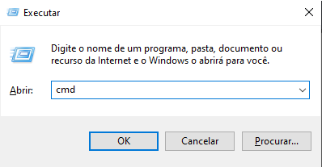

# Instalação do Dart

> # Abra seu cmd com:

## Windows + R
<html>
   <br>
</html>

## Digite cmd e com o atalho Ctrl + Shirt + Enter, já executando o cmd no modo de administrador.
<html>
   
</html>

<html>
   <br>
   <br>
</html>

> # Logo em seguida coloque no seu cmd:
```cmd
   @"%SystemRoot%\System32\WindowsPowerShell\v1.0\powershell.exe" -NoProfile -InputFormat None -ExecutionPolicy Bypass -Command "[System.Net.ServicePointManager]::SecurityProtocol = 3072; iex ((New-Object System.Net.WebClient).DownloadString('https://community.chocolatey.org/install.ps1'))" && SET "PATH=%PATH%;%ALLUSERSPROFILE%\chocolatey\bin"
```

# Instalado o Choco, vamos instalar o Chocolatey no cmd coloque:

```cmd
 | choco install chocolatey 
```

> ``
 " Caso não instale reinici o computador e tente novamente. " 
 ``

<html>
   <br>
</html>

# Agoran vamos instalar o Dart no cmd coloque:

```cmd
 | choco install dart-sdk 
 ```

> `` " Caso não instale reinici o computador e tente novamente. " ``

<html>
   <br>
</html>

Instalado o Dart e o Chocolatey na sua máquina, vamos instalar o dart no VSCode. No menu extenções instale o Dart no seu VSCode. Depois da instalação do Dart, Abra um arquivo novo chamado " HelloWord.dart "   Depois coloque esse código no arquivo:

```dart
main(){
   print("Hello Word")
}
```

Caso não apareça " Hello Word " reinstale o Dart e o Chocolatey


Link do documneto utilizado nesse trabalho: <a taget="_blank" href="https://docs.chocolatey.org/en-us/choco/setup#more-install-options">chocolatey</a>
<br>
Esse é um trabalho Escolar 